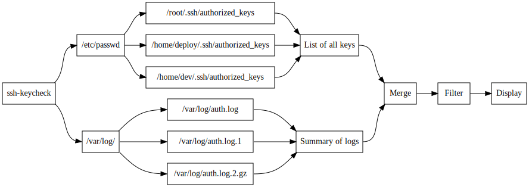

# ssh-keycheck

[](https://travis-ci.org/syxolk/ssh-keycheck)
[](https://coveralls.io/github/syxolk/ssh-keycheck)
[](https://goreportcard.com/report/github.com/syxolk/ssh-keycheck)

`ssh-keycheck` is a tool that gives you a quick overview of all authorized
ssh keys on your server and their last use and usage count. This may be
helpful for manual key expiration.

This tool does not attempt to change anything. All files are opened in read-only
mode.

## Installation

Download the latest package from the [releases page](https://github.com/syxolk/ssh-keycheck/releases).

```sh
tar xvf ssh-keycheck.tar.gz
sudo cp ssh-keycheck /usr/local/bin

# Add setuid flag to allow execution of ssh-keycheck without sudo
sudo chown root:root /usr/local/bin/ssh-keycheck
sudo chmod u+s /usr/local/bin/ssh-keycheck
```

Please inform yourself about [setuid](https://en.wikipedia.org/wiki/Setuid) before setting it.

## Usage

```
~$ ssh-keycheck -help
Usage of ssh-keycheck:
  -csv
        Print table as CSV (RFC 4180) using RFC 3339 for dates
  -fingerprint-md5
        Show fingerprint (MD5) column
  -fingerprint-sha256
        Show fingerprint (SHA256) column
  -help
        Show help and exit
  -insecure
        List only insecure keys
  -secure
        List only secure keys
  -unused int
        List only keys more than x days not used
  -used int
        List only keys used in the last x days
  -user string
        List only keys with matching user name
  -version
        Show version and exit
```

```
~$ ssh-keycheck
USER  COMMENT           TYPE      SECURITY  LAST USE       COUNT  LAST IP
root  rsa-key-20170101  RSA-4096  ok        never              -  -
root  rsa-key-20170102  DSA       insecure  9 minutes ago      3  10.0.0.10
```

## How does it work?
- Read all users from `/etc/passwd`
- Read `~/.ssh/authorized_keys` file from each user's home directory
- Read all `/var/log/auth.log*` files and search for *Accepted publickey*
- Match public keys to logs

You may need to change your `/etc/ssh/sshd_config` in order to enable the
required log messages:
```
LogLevel VERBOSE
```

## Why does it require root?
The log files under `/var/log` require root rights.

## Development
Requires a recent Go version (only tested with Go >=1.9)

```
go get github.com/syxolk/ssh-keycheck
```

## Concurrent execution



## Algorithm security

The column `SECURITY` gives a hint whether the key algorithm is
insecure or became deprecated. The following algorithms are currently
considered insecure:

- [DSA was disabled in OpenSSH 7.0](https://www.gentoo.org/support/news-items/2015-08-13-openssh-weak-keys.html)
- [ECDSA is difficult to implement and may be designed with a backdoor](https://wiki.archlinux.org/index.php/SSH_keys#ECDSA)
- [RSA with key lengths below 2048 are insecure](https://www.keylength.com/en/4/)
